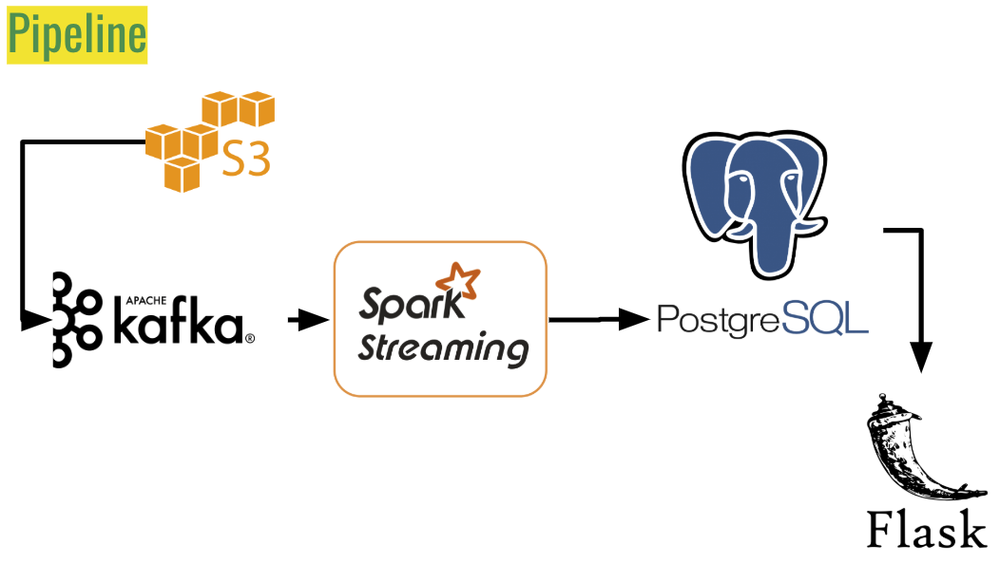

# FolioDream

Using real-time and historical stock market price data, I’ve developed an app that will inform a trade strategy.

Using a technical indicator referred to as [Bollinger Bands](https://www.bollingerbands.com/bollinger-bands), we can use real-time stock exchange price data to know
1. When a price value is significant enough to be watched
2. When a watched stock price warrants a buy or sell action

Historical trading data is made available as a bulk download by [IEX](https://iextrading.com/trading/market-data/#hist-download). The trading data is provided as a PCAP file and stored in S3.  
A Python Kafka producer simulates real-time exchange by reading relevant exchange messages onto Kafka queue distributed on a 3 node EC2 cluster.

A Spark Streaming job distributed over a 4-node EC2 cluster picks up the price updates and compares unflagged values against Bollinger Band values, flagging significant stock. It also compares the price values of flagged stocks to the BB values to check for BUY or SELL opportunities. Significant trade events and flags are saved to a Postgres database and are then immediately available to a Flask based website. 

